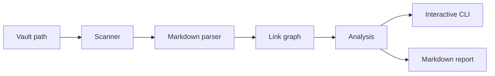

# rust-vault-map

`rust-vault-map` turns a folder of Markdown notes into a readable knowledge-map diagnosis.

The problem is simple: Obsidian-style vaults grow faster than people can maintain them. Links break, useful notes become isolated, old notes disappear into folders, and clusters of related ideas are hard to see from the file tree alone.

This CLI scans a vault, builds an explainable graph from wiki links, and shows what needs attention. It is terminal-first, deterministic, and intentionally small enough to be trusted: no AI summaries, no database, no vault mutation, just fast Rust analysis and a clean report.

## Demo

Interactive mode is the default:

```powershell
rust-vault-map scan D:\path\to\vault
```

Use arrow keys to browse sections such as broken links, orphan notes, stale notes, hubs, clusters, and suggested links.

For a quick artifact, write the findings to Markdown:

```powershell
rust-vault-map scan D:\path\to\vault --report
```

That creates a unique file in the current directory:

```text
Report written to D:\work\report-home-a13f20c9.md
```

Sample report excerpt:

```text
rust-vault-map scan report
Scanned path: D:\path\to\vault

Summary
Markdown notes: 9
Folders: 3
Obsidian links: 13
Broken links: 1
Orphan notes: 1
Stale threshold: 90 days
Oldest scanned note age: 30 days

Broken links
Index.md -> Missing Note

Clusters
Clusters: 3 total
2 multi-note clusters
1 one-note clusters
```

## What It Reports

- Markdown notes and folders scanned
- Obsidian wiki links found
- broken links
- orphan notes with no inbound links
- stale notes by modified date
- hub notes ranked by inbound and outbound links
- basic graph clusters
- suggested links from unlinked title mentions

## How It Works



The analysis is deterministic by design. Reports use stable ordering so output is reviewable, testable, and useful in CI.

## V1 Scope

Included in 1.0:

- recursive `.md` discovery
- hidden/build folder skipping
- `[[Note]]`, `[[Note|Alias]]`, and `[[Folder/Note]]` links
- interactive terminal browsing
- Markdown report export with unique filenames
- unit and integration coverage for scanner, parser, graph, analysis, reporting, and CLI behavior
- GitHub Actions for formatting, linting, tests, coverage, dependency policy, and releases

Not included in 1.0:

- AI summaries or embeddings
- database storage
- static HTML graph output
- Obsidian plugin support
- config files
- automatic edits to the user's vault

## Tech Stack

- Rust stable
- `clap` for command parsing
- `dialoguer` for interactive terminal prompts
- `anyhow` and `thiserror` for errors
- `assert_cmd`, `predicates`, and `tempfile` for tests
- `semantic-release` for automated versioning and GitHub releases

## Local Development

```powershell
cargo build
cargo run -- scan D:\path\to\vault
cargo run -- scan D:\path\to\vault --report
```

Quality checks:

```powershell
cargo fmt --check
cargo clippy --all-targets --all-features -- -D warnings
cargo test --all --locked
cargo llvm-cov --all-features --workspace --fail-under-lines 80
```

Release dry run:

```powershell
npm install
npm run release:dry
```

## Repository Layout

```text
rust-vault-map/
  src/
    cli.rs
    scanner.rs
    parser.rs
    graph.rs
    analysis.rs
    interactive.rs
    report.rs
  tests/
  .github/workflows/
```

## Versioning

The project starts at `1.0.0`. Releases are automated from `main` with semantic-release and conventional commits. Each release updates the Cargo/package version, creates a Git tag, and publishes GitHub release notes.

## Roadmap

Possible next steps: JSON output, configurable stale thresholds, richer Markdown parsing, graph export, benchmark reporting, and prebuilt release binaries.
