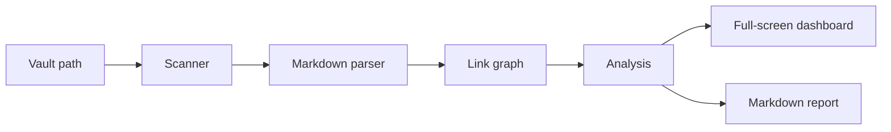
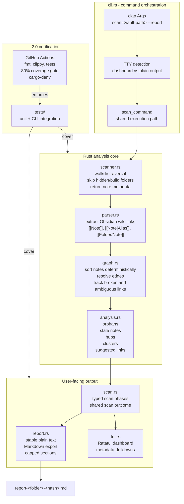

# rust-vault-map

`rust-vault-map` turns a folder of Markdown notes into an interactive knowledge-map diagnosis.

The problem is simple: Obsidian-style vaults grow faster than people can maintain them. Links break, useful notes become isolated, old notes disappear into folders, and clusters of related ideas are hard to see from the file tree alone.

This CLI scans a vault, builds an explainable graph from wiki links, and shows what needs attention. It is terminal-first and deterministic: no AI summaries, no database, and no automatic rewrites. The full-screen dashboard helps you inspect issues and open the relevant Markdown files in your editor when you choose to fix them.

## Demo

In an interactive terminal, scan opens the full-screen dashboard:

```powershell
rust-vault-map scan D:\path\to\vault
```

Use `Up` and `Down` to move through sections, then `Right` or `Enter` to inspect a section. Inside a findings list, use `Up` and `Down` to move through items, `Left` to return to sections, and `Enter` or `o` to open the selected Markdown file in your editor. Press `e` or `r` from the dashboard to export a Markdown report.

For deterministic text output in a terminal, use:

```powershell
rust-vault-map scan D:\path\to\vault --plain
```

For a quick artifact, write the findings to Markdown:

```powershell
rust-vault-map scan D:\path\to\vault --report
```

That creates a unique file in the current directory:

```text
Report written to D:\work\report-home-a13f20c9.md
```

Sample report excerpt:

```text
rust-vault-map scan report
Scanned path: D:\path\to\vault

Summary
Markdown notes: 9
Folders: 3
Obsidian links: 13
Broken links: 1
Orphan notes: 1
Stale threshold: 90 days
Oldest scanned note age: 30 days

Broken links
Index.md -> Missing Note

Clusters
Clusters: 3 total
2 multi-note clusters
1 one-note clusters
```

## What It Reports

- Markdown notes and folders scanned
- Obsidian wiki links found
- broken links
- orphan notes with no inbound links
- stale notes by modified date
- hub notes ranked by inbound and outbound links
- basic graph clusters
- suggested links from unlinked title mentions

## What You Can Do In The Dashboard

- browse vault health metrics and prioritized next actions
- inspect broken links, ambiguous links, orphan notes, stale notes, hubs, clusters, and suggested links
- keep long findings lists scrolled to the selected row
- open the selected Markdown note through `$VISUAL`, `$EDITOR`, or the OS fallback editor
- export a deterministic Markdown report
- fall back to stable plain text output for scripts and CI

## How It Works



Component view:



The analysis is deterministic by design. Plain reports use stable ordering so output is reviewable, testable, and useful in CI; the dashboard is reserved for real TTY sessions.

## Product Scope

Included:

- recursive Markdown note discovery
- hidden/build folder skipping
- `[[Note]]`, `[[Note|Alias]]`, and `[[Folder/Note]]` links
- full-screen terminal dashboard for TTY sessions
- deterministic plain text output for non-TTY sessions and `--plain`
- Markdown report export with unique filenames
- external editor launch for selected Markdown notes
- unit and integration coverage for scanner, parser, graph, analysis, reporting, and CLI behavior
- GitHub Actions for formatting, linting, tests, coverage, dependency policy, and releases

Not included:

- AI summaries or embeddings
- database storage
- static HTML graph output
- Obsidian plugin support
- config files
- automatic edits to the user's vault without opening an editor

## Tech Stack

- Rust stable
- `clap` for command parsing
- `ratatui` and `crossterm` for the dashboard
- `dialoguer` for interactive terminal prompts
- `anyhow` and `thiserror` for errors
- `assert_cmd`, `predicates`, and `tempfile` for tests
- `semantic-release` for automated versioning and GitHub releases

## Local Development

```powershell
cargo build
cargo run -- scan D:\path\to\vault
cargo run -- scan D:\path\to\vault --plain
cargo run -- scan D:\path\to\vault --report
```

Quality checks:

```powershell
cargo fmt --check
cargo clippy --all-targets --all-features -- -D warnings
cargo test --all --locked
cargo llvm-cov --all-features --workspace --fail-under-lines 80
```

Release dry run:

```powershell
npm install
npm run release:dry
```

## Repository Layout

```text
rust-vault-map/
  src/
    cli.rs
    scanner.rs
    parser.rs
    graph.rs
    analysis.rs
    scan.rs
    tui.rs
    report.rs
    interactive.rs
  tests/
  .github/workflows/
```

## Versioning

The current major version is `2.0.0`, reflecting the move from a report-first CLI to a full-screen terminal dashboard. Releases are automated from `main` with semantic-release and conventional commits. Each release updates the Cargo/package version, creates a Git tag, and publishes GitHub release notes.

## Roadmap

Possible next steps: JSON output, configurable stale thresholds, richer Markdown parsing, graph export, light/dark theme variants, benchmark reporting, and prebuilt release binaries.
